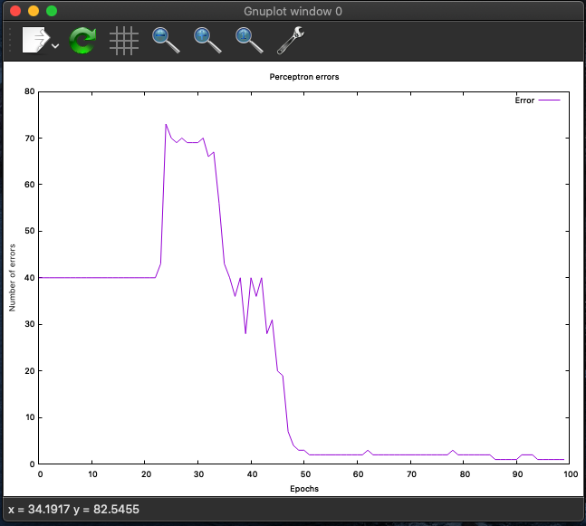

Perceptron from scratch in C++.  
Tested on Iris dataset. 
Plotting error plot with gnuplot. 

Requirements:
- Gnuplot (apt-get install gnuplot(linux), brew install gnuplot (mac))

#### Run program by: ./startProgram

### Example plot

